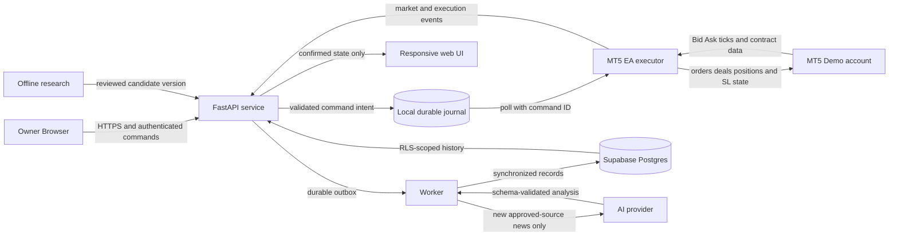

# Sochron1k Architecture and Trust Boundaries

## Architecture decision

The first release uses a modular monorepo and a single Demo execution account. Components are separated by responsibility and trust boundary without introducing distributed services beyond what execution durability and asynchronous work require.

## Component ownership

| Component | Responsibility | Authoritative for | Must not do |
| --- | --- | --- | --- |
| MT5 and EA | Market intake, order send, broker events, SL enforcement | Prices, orders, deals, positions, broker-side SL | Depend on AI or Supabase to manage an open position |
| API service | Authentication, input validation, orchestration, query API | Accepted application commands and active version reference | Claim broker success before MT5 evidence |
| Worker | News, AI, synchronization, reconciliation jobs | Job attempts and operation IDs | Block the tick/risk loop or change risk policy |
| Local journal | Write-ahead commands, events, acknowledgements, retry state | Unsynchronized operational evidence | Drop or replay unknown work silently |
| Supabase | Auth, RLS, synchronized history, audit records | Persisted research and synchronized application history | Store unrestricted MT5 credentials or receive every raw tick |
| Web application | Monitoring, versioned settings, authorized control requests | User intent submitted through the API | Hold privileged keys or decide execution truth |
| Research | Backtests, datasets, metrics, candidate strategies | Versioned experiment evidence | Promote itself or modify the active strategy silently |
| AI provider | News classification and bounded research support | Its own returned analysis only | Authorize a trade, risk limit, halt release, or strategy promotion |

## Planned repository map

| Path | Boundary |
| --- | --- |
| `apps/web` | React and TypeScript UI |
| `services/api` | FastAPI service and deterministic application policies |
| `services/worker` | Asynchronous synchronization, news, AI, and reconciliation |
| `mt5/ea` | MQL5 execution adapter and broker-side safeguards |
| `research` | Backtests, datasets, feature parity, and evaluation |
| `supabase/migrations` | Postgres schema, constraints, and RLS |
| `tests` | Acceptance, integration, contract, resilience, and UI checks |
| `scripts` | Verified project commands and local operators |

Paths should be created when their first implementation is added. Empty directories are not evidence that a component exists.

## Required contracts

### Market event

Every event includes source/feed ID, symbol, Bid, Ask, event time, received time, tick size, price unit, and market-session context. Invalid Bid greater than Ask, unexpected time reversal, malformed values, and unexplained gaps are rejected or quarantined. Missing ticks are never synthesized as real prices.

### Command intent

Every command includes `command_id`, `signal_id`, `experiment_id`, idempotency key, account reference, symbol, side, requested volume, intended entry, SL, TP, expiry, risk-policy version, strategy version, and creation time. The durable journal records the command before an external send.

### Execution state

The initial state machine is:

`CREATED -> VALIDATED -> QUEUED -> SENT -> ACKNOWLEDGED -> FILLED | PARTIALLY_FILLED -> CLOSED`

Terminal or alternate states include `REJECTED`, `EXPIRED`, `CANCELLED`, and `UNKNOWN`. `UNKNOWN` requires reconciliation against MT5 orders, positions, and history before a retry or replacement.

Cancel-pending and close-position are separately idempotent management commands,
not rewrites of the entry command. Each is journaled before executor invocation and
reconciles cumulative broker evidence. A partial entry cancels its pending remainder
before closing its filled position. Exposure remains reserved through ambiguous or
partial management, and a risk halt blocks new entries without blocking risk-reducing
management. See [ADR-017](decisions/ADR-017-durable-position-management.md).

### Strategy evidence

Signals and zones record both `formed_at` and `confirmed_at`, the strategy version, parameter set, data cutoff, evidence IDs, and expiry. Research and UI must not present a signal as available before its confirmation time.

## System invariants

- No path can select or execute against a live account in the first release.
- At most one logical position or pending order exists for the experiment.
- The same idempotency key and request fingerprint cannot produce another logical trade.
- A reused idempotency key with a different payload is rejected.
- Risk is calculated from actual account currency, contract metadata, current Equity, and broker volume constraints.
- If the broker minimum volume exceeds the risk budget, the command is rejected; risk is not increased.
- A position is not labelled protected until MT5 confirms the broker-side SL.
- Halt state, risk baselines, pending commands, and external identifiers survive restart.
- UI state reflects confirmed backend and MT5 state, including pending or unknown transitions.
- AI output cannot change deterministic risk or execution rules.
- Historical decision snapshots are immutable; corrections create a new revision.

SCN-007's optional local native-bar spool is separate from the command journal.
It retains immutable closed bars and capture receipts before chart acknowledgment;
latest frames are replaceable validation projections only. History reads are
owner-authenticated and tied to a stable archive/receipt watermark. It is not
Parquet raw-tick capture, synchronized Supabase history or strategy decision evidence;
see [ADR-008](decisions/ADR-008-local-native-bar-history.md).

SCN-008 now has an immutable Supabase M1 receiver and a read-only worker source
adapter under `services/worker/src/sochron_worker`. The adapter reuses the existing
archive/domain validators (not API routes or the app entry point), pins the source
archive/binding and exports closed M1 rows in receipt/time order. It performs no
network operation and does not persist or acknowledge a synchronization cursor.
A separate private SQLite sync journal and one-step driver now persist exact
intent/UNKNOWN before send and advance the cursor only after independent read-back.
Local process-crash recovery is verified with synthetic source data and both a
durable test destination and actual local Auth/PostgREST. Private config, bounded
HTTP RPC transport and a serial explicit operator runner now exist, disabled
without configuration. Neither API startup nor
Compose starts the worker. Local Supabase HTTP/role integration has
[AC-06 evidence](verification/SCN-008-local-sync.md). An internal Python wheel now
ships both domain and worker packages with an installed operator command;
see [ADR-010](decisions/ADR-010-python-delivery-artifact.md). An opt-in Linux worker
image and isolated container-replacement verifier now exist; default API/web
Compose still starts no worker. See [ADR-011](decisions/ADR-011-worker-container.md).
Fixed SQLite source/linkage and affected Linux tests now have
[local admission evidence](verification/SCN-003-fixed-sqlite.md). Hosted integration
and full target recovery remain outstanding;
see [ADR-009](decisions/ADR-009-native-m1-sync-boundary.md).

SCN-009 adds an internal WAL-aware SQLite snapshot/isolated-copy library with no
service, endpoint, scheduler or execution authority. Individual snapshots preserve
committed database bytes and carry integrity metadata; they are not a consistent
multi-store recovery set. Individual integrity is not domain or operator admission.
See [ADR-013](decisions/ADR-013-private-sqlite-snapshots.md) and
[engine evidence](verification/SCN-009-sqlite-snapshots.md).

A read-only three-snapshot domain inspector now verifies command/risk evidence,
all archive timeframes and the full sync ledger against an exact M1 prefix in a
later archive. This is causal compatibility, not atomic multi-file capture or
external reconciliation; see [ADR-014](decisions/ADR-014-recovery-set-admission.md).
An explicit installed recovery operator now captures, verifies and materializes
private bundles with original capture intervals, module/config hashes and measured
local rehearsal. It never activates state or starts a service. Actual-target,
off-host and external reconciliation remain pending; see
[ADR-015](decisions/ADR-015-local-recovery-operator.md).
An explicit worker `reconcile` action now queries only the current UNKNOWN batch
without sending or increasing attempts. A synthetic installed-artifact rehearsal
reopens recovered runtime copies at their exact original fixture paths and checks
worker read-back and query-only command recovery. This is not an owner activation
tool or complete external-state inventory; actual-target admission remains pending.

## Failure behavior

SCN-010 now gates the local ExecutionService behind explicit inventory/risk startup
admission, rechecks it before submissions, and validates broker evidence before
journal application. No execution endpoint or MT5 mutation adapter is exposed;
see [ADR-016](decisions/ADR-016-execution-startup-admission.md). This is local
simulator admission, not distributed fencing or a cleared Demo release gate.

SCN-011 extends that local boundary with durable cancel/close commands, management
inventory at startup, deterministic halt latching and a final closed-trade audit.
Ambiguous management remains UNKNOWN and query-only reconciliation never resends.
This remains simulator evidence; no MT5 mutation adapter or external control route
exists. See [ADR-017](decisions/ADR-017-durable-position-management.md).

SCN-012 adds a disabled-by-default, separately authenticated polling adapter for one
future MT5 Demo executor. Boot/generation fencing, one claimed dispatch, exact replay,
bounded waits, cumulative outcome binding and no-effect rejection evidence preserve
the journal-before-send and UNKNOWN-before-retry rules. The API-side transport has
synthetic local evidence only; no MQL5 mutation or target connection exists. See
[ADR-018](decisions/ADR-018-execution-polling-bridge.md) and the
[execution bridge runbook](operations/execution-bridge.md).

SCN-013 fixes the corresponding pure MQL5 wire boundary before adding mutation.
The source-only codec parses the exact command envelope and encodes empty bootstrap,
confirmed-rejection and uncertain evidence. Static guards prohibit network, account,
file and trading access in the header; its script writes only named synthetic
fixtures. It consumes ADR-018 rather than changing the transport architecture.
It is uncompiled and has no executor lock, ledger, preflight, inventory scan,
`OrderCheck`, `OrderSend`, transaction handling or reconciliation authority.

| Failure | Required behavior |
| --- | --- |
| AI unavailable or invalid | Strategies that require AI enter `WAIT`; position management continues |
| Supabase unavailable | Continue durable local journaling; stop new entries if durable evidence cannot be written |
| Price stale or feed gap | Stop new entries, display age and reason, continue managing existing positions |
| Send timed out or response lost | Mark `UNKNOWN`, query MT5 by identifiers and time, then reconcile before retry |
| Restart with pending or open state | Restore journal and halt state, reconcile MT5, quarantine unknown state, accept no new work until complete |
| SL rejected after fill | Enter emergency handling, attempt an authorized close per runbook, alert, and do not report protected |
| Risk limit reached | Cancel pending work, attempt authorized close, persist the halt, and require the defined release authority |
| Executor identity uncertain | Reject control commands and remain halted until account, server, mode, and symbol are verified |

## Trust boundaries

- Browser to API: authenticate the user, authorize the resource and action, validate schemas, and require idempotency for mutations.
- API to executor: use a dedicated identity, narrow network exposure, short timeouts, command IDs, and an explicit Demo-account preflight.
- Worker to external sources and AI: restrict destinations, validate redirects and payload size, record provenance, and treat content as untrusted data.
- Backend to Supabase: privileged keys remain server-side. All browser-readable tables use owner-based RLS and negative authorization tests.
- Development to deployment: untrusted code and pull requests do not receive production-like secrets or publish permission.

## Deployment direction

The target is a Hostinger Linux VPS with MT5 under Wine plus Docker Compose services. This is a hypothesis that must pass an integration spike, restart recovery, network-interruption test, and multi-day Demo burn-in. If Wine is not reliable, only the MT5 executor moves to a Windows host while preserving the API contract. The fallback requires a separate cost and authorization decision.

## Architecture fitness checks to add with implementation

- The web bundle contains no service-role key, MT5 credential, or executor token.
- Only the executor adapter can create MT5 commands.
- Strategy and AI modules cannot import or invoke halt-release operations.
- Every command mutation requires an idempotency key and durable journal record.
- Database tables exposed to the browser have enabled RLS and denied cross-owner fixtures.
- Backtest features cannot read data with `available_at` after the simulated decision time.

These checks are requirements, not current evidence. They become gate evidence only after the implementation and verifiers exist.
